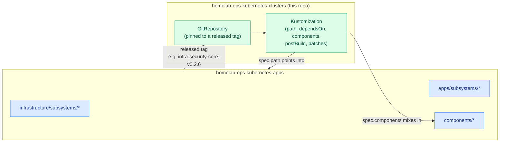
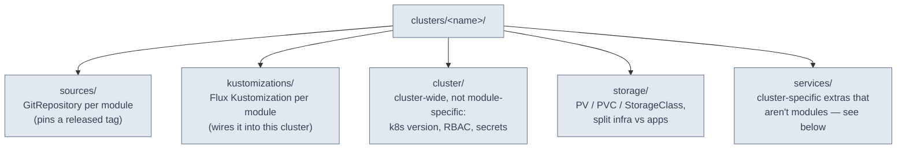
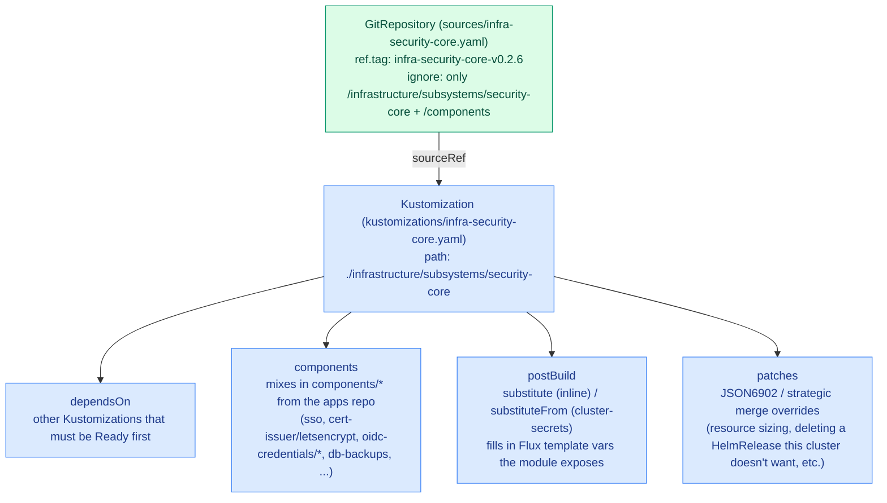
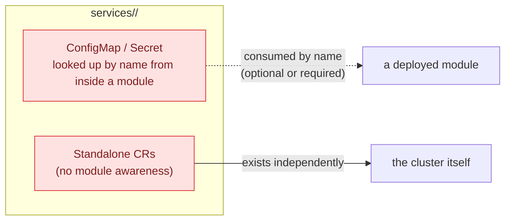
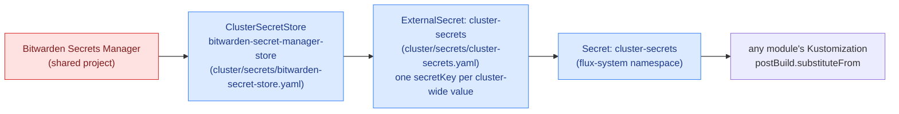

# Design

This document explains how this repository is structured and why: the directory
shape every cluster follows, how a module from the sibling apps repo gets wired
into a running cluster, and the supporting mechanisms (secrets, RBAC, storage,
policy, CI, versioning) that make it work.

For what each cluster actually runs, see [clusters/homelab/README.md](./clusters/homelab/README.md)
and [clusters/nas/README.md](./clusters/nas/README.md). For the modules
themselves — what they are and how they're organized — see the apps repo's
[projectBrief.md](https://github.com/ppat/homelab-ops-kubernetes-apps/blob/main/projectBrief.md).

## Two repositories, one system

This repo has no application code and defines no modules of its own. It holds
only the cluster-specific wiring — Flux resources that say "deploy version X of
module Y, configured this way, on this cluster." The modules themselves
(infrastructure subsystems, apps, cross-cutting components) live in the sibling
[`homelab-ops-kubernetes-apps`](https://github.com/ppat/homelab-ops-kubernetes-apps)
repo and are released there independently, one version per module.



The same module, at different versions, with different components/patches/variables,
can be (and is) referenced by both clusters at once — that's how one set of
modules serves two clusters with different needs.

## Cluster directory anatomy

Every cluster under `clusters/<name>/` follows the same shape:



| Directory | Contents | Consumed by |
| --- | --- | --- |
| `sources/` | One Flux `GitRepository` per module, `spec.ref.tag` pinned to a release of the apps repo, `spec.ignore` scoped to just that module's directory (plus `/components`) | Referenced by the matching `kustomizations/*.yaml` via `spec.sourceRef` |
| `kustomizations/` | One Flux `Kustomization` per module (or per cluster-local config group), the actual deploy wiring | Applied by the `root` Kustomization, which Flux itself watches |
| `cluster/` | `kubernetes-version/` (k3s upgrade `Plan`), `rbac/` (admin/readonly `ClusterRoleBinding`s), `secrets/` (Bitwarden `ClusterSecretStore` + the `cluster-secrets` `ExternalSecret`) | Bootstrapped once per cluster, not tied to any single module |
| `storage/` | `infra/` and `apps/` subtrees of `PersistentVolume`/`PersistentVolumeClaim`/`StorageClass`/Longhorn `RecurringJob`, matching the module that will claim them | Pre-provisioned ahead of the module that mounts them (see [Storage](#storage)) |
| `services/` | Cluster-specific extras that aren't modules at all — see [The `services/` directory](#the-services-directory) | Either looked up by name from inside a module, or standalone (no module awareness) |

`root.yaml` in `kustomizations/` is the Flux bootstrap entry point: it's the one
`Kustomization` that Flux is told about directly, with `spec.path: ./clusters/<name>`,
and it recursively picks up everything else in the cluster directory via plain
Kustomize `resources:` composition — not via `dependsOn`.

## Wiring a module into a cluster

A `sources/<module>.yaml` + `kustomizations/<module>.yaml` pair is how a module
gets deployed. The `Kustomization` is where all cluster-specific decisions about
that module are made:



Concrete example — `infra-security-core` on `homelab`:

```yaml
# clusters/homelab/kustomizations/infra-security-core.yaml
spec:
  components:
  - ../../../components/cert-issuer/letsencrypt   # mix in a component
  path: ./infrastructure/subsystems/security-core  # module path in the apps repo
  sourceRef:
    kind: GitRepository
    name: infra-security-core                      # matches sources/infra-security-core.yaml
  postBuild:
    substitute:
      secret_store: bitwarden-secret-manager-store
    substituteFrom:
    - kind: Secret
      name: cluster-secrets                          # see Secrets below
```

All four mechanisms — `dependsOn`, `components`, `postBuild`, `patches` — are
applied *only* at this point of use, never inside the module itself. That's what
lets the same module serve both clusters differently: `infra-networking-core` on
`homelab` sets `externaldns_txtowner_prefix: k8s.` while on `nas` it's `k8s.nas.`,
and `nas`'s copy patches Traefik to run as a `Deployment` with 2 replicas instead
of a `DaemonSet`.

## The `services/` directory

`services/<name>/` holds cluster-specific resources that exist *outside* any
module's own manifests, for two distinct reasons:

1. **Extra config/secrets consumed by a module.** A module's app may look up a
   `ConfigMap`/`Secret` by a fixed name at runtime, or a cluster `Kustomization`
   may inject it via a patch or `postBuild` variable. Either way, the module
   itself doesn't ship this object — it's cluster-specific and may be optional.
   Example: `services/downloaders/downloaders-gluetun-config.yaml` is a
   `ConfigMap` named `gluetun-config` that the `gluetun` container inside the
   `apps-downloaders` module reads directly by name (VPN provider, server
   selection, port-forwarding hooks) — the downloaders module works without it,
   but qBittorrent's traffic won't route through a VPN unless it's present.
2. **Standalone extra resources with no module awareness.** CRDs or other
   objects that just need to exist on this cluster, independent of any module's
   name-lookup contract. Example: `services/tailscale/connector.yaml` (a
   Tailscale `Connector` advertising the homelab subnet and acting as an exit
   node) and `proxyclass.yaml` — these aren't referenced by any module, they're
   deployed because this cluster needs a subnet router.



`config-services` (a `kustomizations/config-services.yaml` entry) applies
everything under `services/` cluster-wide, `dependsOn` whatever
security/networking core it needs.

## Storage

`storage/infra/` and `storage/apps/` hold `PersistentVolume`, `PersistentVolumeClaim`,
and `StorageClass` objects, pre-provisioned ahead of the module that will claim
them (by matching PVC name) — infra objects for infrastructure modules (e.g.
`minio-data`, `unifi-data`), apps objects per app subsystem (e.g.
`storage/apps/pvc/downloaders/*`). `storage/infra/job/` on `homelab` also holds
Longhorn `RecurringJob` snapshot/backup/trim schedules. `PersistentVolume`,
`PersistentVolumeClaim`, `StorageClass`, and `RecurringJob` are excluded from
Flux pruning (patched via `kustomize.toolkit.fluxcd.io/prune: disabled`) since
deleting them would mean data loss.

The `nas` cluster mounts NFS shares dynamically (`sc-nfs-dynamic-share`) or
statically per app (`storage/apps/pv/<app>/static-nfs-share-*.yaml`), while
`homelab` mixes Longhorn-backed classes (`sc-longhorn-replicated`,
`sc-longhorn-local-non-replicated`, `sc-longhorn-rwx`) with static NFS mounts
for large media libraries.

## Secrets

All cluster secrets originate from a shared Bitwarden Secrets Manager project,
surfaced into each cluster via External Secrets Operator:



`cluster-secrets` holds cluster-wide values (DNS zone, domain name, external IPs
for MetalLB/Pi-hole/Plex/etc., cert-issuer email) that many modules'
`postBuild.substituteFrom` pull from. Module-specific secrets (e.g. the
downloaders' VPN key in `services/downloaders/downloaders-gluetun-secrets.yaml`)
are their own `ExternalSecret`s pointed at the same `ClusterSecretStore`, scoped
to the namespace that needs them. `ClusterSecretStore`/`ExternalSecret` objects
in `cluster/secrets/` are prune-disabled for the same reason storage is —
losing the pointer to Bitwarden shouldn't be a side effect of a bad Kustomize
diff.

## RBAC

`cluster/rbac/` binds two Kubernetes API groups (`homelab-admins`,
`homelab-users`) — backed by the OIDC identity provider from the apps repo's
`security-extra` module — to the built-in `cluster-admin` and `view`
`ClusterRole`s via `ClusterRoleBinding`s. These are cluster-wide and unrelated
to any single module.

## Policy enforcement

Kyverno `ClusterPolicy`/`ClusterCleanupPolicy` objects live in the shared,
cluster-agnostic `policies/` directory at the repo root (not under
`clusters/`) and are applied to both clusters via their own
`policy-*` Kustomizations. See [policies/README.md](./policies/README.md) for
what's enforced and in what mode.

## CI and validation

| Workflow | Trigger | What it does |
| --- | --- | --- |
| `lint.yaml` | every PR + weekly | yamllint, markdownlint, shellcheck, commitlint, Renovate config check, and `kubeconform`-based Kubernetes manifest validation (via `ci/validation/kustomization.yaml` + `ci/validation/.env` dummy `postBuild` values) restricted to `clusters/*` and `policies/*` |
| `diff-changes.yaml` | PRs touching `clusters/**` or `policies/**` | Checks out the apps repo (`main`) alongside before/after versions of this repo, resolves each `Kustomization`'s `sourceRef` tag via `.github/scripts/prepare-sources.sh`, then runs `flux-diff` to comment a rendered HelmRelease/Kustomization diff on the PR — so a reviewer sees the actual resource-level effect of a version bump or config change before merging |
| `renovate.yaml` | schedule/dispatch | Runs Renovate to open dependency-update PRs |

`pre-commit` mirrors the yamllint/markdownlint/shellcheck/commitlint/kubeconform
checks locally (`.pre-commit-config.yaml`).

## Versioning and updates

Renovate (`.github/renovate.json` + `.github/renovate/*.json`) manages two
categories of updates in this repo:

- **Flux sources** (`clusters/*/sources/*.yaml`): bumps to a module's `ref.tag`
  when a new release lands in the apps repo. Always `automerge: false`, grouped
  and labeled by cluster (`cluster:homelab` / `cluster:nas`) since a version bump
  changes deployed behavior and always warrants review via the `diff-changes`
  PR comment.
- **k3s version** (`cluster/kubernetes-version/server-upgrade.yaml`): patch
  bumps auto-eligible after a 7-day soak; major/minor require review
  (`reviewers: ["ppat"]`) and a 60-day soak.

Commits follow Conventional Commits with `commitlint.config.js` enforcing scope
one of: `cluster-homelab`, `cluster-nas`, `dev-tools`, `github-actions`,
`kubernetes-api`, `policies`, `renovate`, `release`.
