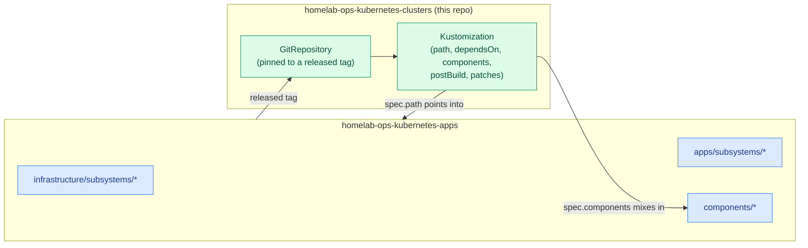
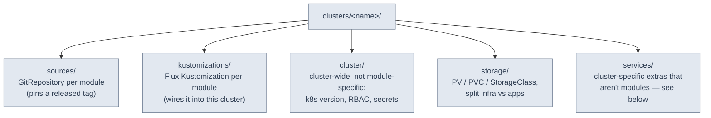
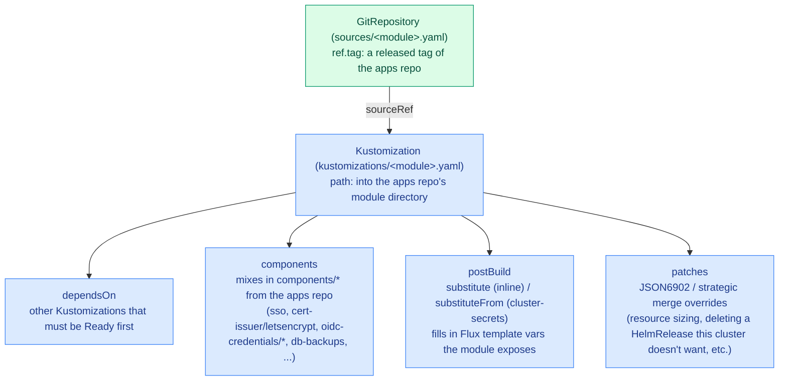
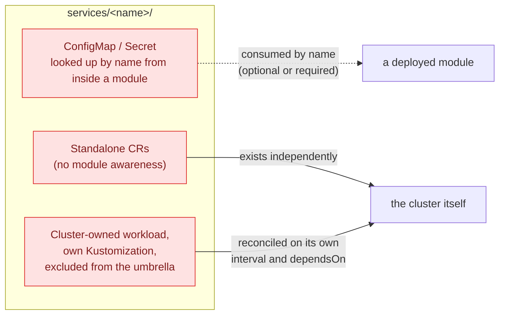
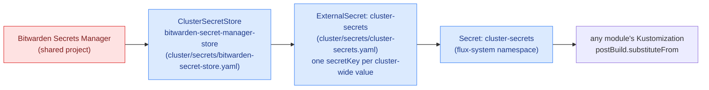

# Design

This document explains how this repository is structured and why: the directory
shape every cluster follows, how a module from the sibling apps repo gets wired
into a running cluster, and the supporting mechanisms (secrets, RBAC, storage,
policy, CI, versioning) that make it work.

For what each cluster actually runs, see [clusters/homelab/README.md](./clusters/homelab/README.md)
and [clusters/nas/README.md](./clusters/nas/README.md). For the modules
themselves — what they are and how they're organized — see the apps repo's
[projectBrief.md](https://github.com/ppat/homelab-ops-kubernetes-apps/blob/main/projectBrief.md).

## Two repositories, one system

This repo has no application code and defines no modules of its own. It holds
only the cluster-specific wiring — Flux resources that say "deploy version X of
module Y, configured this way, on this cluster." The modules themselves
(infrastructure subsystems, apps, cross-cutting components) live in the sibling
[`homelab-ops-kubernetes-apps`](https://github.com/ppat/homelab-ops-kubernetes-apps)
repo and are released there independently, one version per module.


```mermaid
flowchart LR
    subgraph apps["homelab-ops-kubernetes-apps"]
        M1["infrastructure/subsystems/*"]
        M2["apps/subsystems/*"]
        M3["components/*"]
    end

    subgraph clusters["homelab-ops-kubernetes-clusters (this repo)"]
        GR["GitRepository\n(pinned to a released tag)"]
        KZ["Kustomization\n(path, dependsOn, components,\npostBuild, patches)"]
        GR --> KZ
    end

    apps -- "released tag" --> GR
    KZ -- "spec.path points into" --> apps
    KZ -- "spec.components mixes in" --> M3

    classDef appsStyle fill:#dbeafe,stroke:#3b82f6,color:#1e3a8a
    classDef clusterStyle fill:#dcfce7,stroke:#059669,color:#064e3b
    class M1,M2,M3 appsStyle
    class GR,KZ clusterStyle
```

The same module, at different versions, with different components/patches/variables,
can be (and is) referenced by both clusters at once — that's how one set of
modules serves two clusters with different needs.

## Cluster directory anatomy

Every cluster under `clusters/<name>/` follows the same shape:


```mermaid
flowchart TB
    root["clusters/&lt;name&gt;/"]
    sources["sources/\nGitRepository per module\n(pins a released tag)"]
    kusts["kustomizations/\nFlux Kustomization per module\n(wires it into this cluster)"]
    cluster["cluster/\ncluster-wide, not module-specific:\nk8s version, RBAC, secrets"]
    storage["storage/\nPV / PVC / StorageClass,\nsplit infra vs apps"]
    services["services/\ncluster-specific extras that\naren't modules — see below"]

    root --> sources
    root --> kusts
    root --> cluster
    root --> storage
    root --> services

    classDef dir fill:#e2e8f0,stroke:#64748b,color:#334155
    class root,sources,kusts,cluster,storage,services dir
```

| Directory | Contents | Consumed by |
| --- | --- | --- |
| `sources/` | One Flux `GitRepository` per module, `spec.ref.tag` pinned to a release of the apps repo, `spec.ignore` scoped to just that module's directory (plus `/components`) | Referenced by the matching `kustomizations/*.yaml` via `spec.sourceRef` |
| `kustomizations/` | One Flux `Kustomization` per module (or per cluster-local config group), the actual deploy wiring | Applied by the `root` Kustomization, which Flux itself watches |
| `cluster/` | `kubernetes-version/` (k3s upgrade `Plan`), `rbac/` (admin/readonly `ClusterRoleBinding`s), `secrets/` (Bitwarden `ClusterSecretStore` + the `cluster-secrets` `ExternalSecret`) | Bootstrapped once per cluster, not tied to any single module |
| `storage/` | `infra/` and `apps/` subtrees of `PersistentVolume`/`PersistentVolumeClaim`/`StorageClass`/Longhorn `RecurringJob`, matching the module that will claim them | Pre-provisioned ahead of the module that mounts them (see [Storage](#storage)) |
| `services/` | Cluster-specific extras that aren't modules at all — see [The `services/` directory](#the-services-directory) | Either looked up by name from inside a module, or standalone (no module awareness) |

`root.yaml` in `kustomizations/` is the Flux bootstrap entry point: it's the one
`Kustomization` that Flux is told about directly, with `spec.path: ./clusters/<name>`,
and it recursively picks up everything else in the cluster directory via plain
Kustomize `resources:` composition — not via `dependsOn`.

## Wiring a module into a cluster

A `sources/<module>.yaml` + `kustomizations/<module>.yaml` pair is how a module
gets deployed. The `Kustomization` is where all cluster-specific decisions about
that module are made:


```mermaid
flowchart TB
    GR["GitRepository (sources/&lt;module&gt;.yaml)\nref.tag: a released tag of the apps repo"]
    KZ["Kustomization (kustomizations/&lt;module&gt;.yaml)\npath: into the apps repo's module directory"]
    GR -->|sourceRef| KZ

    KZ --> DEP["dependsOn\nother Kustomizations that must be Ready first"]
    KZ --> COMP["components\nmixes in components/* from the apps repo\n(sso, cert-issuer/letsencrypt, oidc-credentials/*, db-backups, ...)"]
    KZ --> PB["postBuild\nsubstitute (inline) / substituteFrom (cluster-secrets)\nfills in Flux template vars the module exposes"]
    KZ --> PATCH["patches\nJSON6902 / strategic merge overrides\n(resource sizing, deleting a HelmRelease this cluster doesn't want, etc.)"]

    classDef src fill:#dcfce7,stroke:#059669,color:#064e3b
    classDef k fill:#dbeafe,stroke:#3b82f6,color:#1e3a8a
    class GR src
    class KZ,DEP,COMP,PB,PATCH k
```

Concrete example — `infra-security-core` on `homelab`:

```yaml
# clusters/homelab/kustomizations/infra-security-core.yaml
spec:
  components:
  - ../../../components/cert-issuer/letsencrypt   # mix in a component
  path: ./infrastructure/subsystems/security-core  # module path in the apps repo
  sourceRef:
    kind: GitRepository
    name: infra-security-core                      # matches sources/infra-security-core.yaml
  postBuild:
    substitute:
      secret_store: bitwarden-secret-manager-store
    substituteFrom:
    - kind: Secret
      name: cluster-secrets                          # see Secrets below
```

All four mechanisms — `dependsOn`, `components`, `postBuild`, `patches` — are
applied *only* at this point of use, never inside the module itself. That's what
lets the same module serve both clusters differently: `networking-core` runs on
both `homelab` and `nas` with different `postBuild.substitute` values (e.g. a
per-cluster DNS TXT-record owner prefix, so external-dns on one cluster doesn't
clobber the other's records) and a patch on `nas` alone that changes how Traefik
is deployed there. The exact values are in each cluster's
`kustomizations/infra-networking-core.yaml`.

## The `services/` directory

`services/<name>/` holds cluster-specific resources that exist *outside* any
module's own manifests, for three distinct reasons:

1. **Extra config/secrets consumed by a module.** A module's app may look up a
   `ConfigMap`/`Secret` by a fixed name at runtime, or a cluster `Kustomization`
   may inject it via a patch or `postBuild` variable. Either way, the module
   itself doesn't ship this object — it's cluster-specific and may be optional.
   Example: `services/downloaders/downloaders-gluetun-config.yaml` is a
   `ConfigMap` named `gluetun-config` that the `gluetun` container inside the
   `apps-downloaders` module reads directly by name (VPN provider, server
   selection, port-forwarding hooks) — the downloaders module works without it,
   but qBittorrent's traffic won't route through a VPN unless it's present.
2. **Standalone extra resources with no module awareness.** CRDs or other
   objects that just need to exist on this cluster, independent of any module's
   name-lookup contract. Example: `services/tailscale/connector.yaml` (a
   Tailscale `Connector` advertising the homelab subnet and acting as an exit
   node) and `proxyclass.yaml` — these aren't referenced by any module, they're
   deployed because this cluster needs a subnet router.
3. **Cluster-owned workloads with their own `Kustomization`.** A directory
   under `services/` can also be a first-class workload the cluster itself
   owns — not config a module looks up, not a no-awareness standalone CR
   either, but something with its own `kustomizations/<name>.yaml` entry,
   deliberately left out of `services/kustomization.yaml`'s `resources:` list
   so the blanket `config-services` Kustomization doesn't also own it. Two
   distinct reasons justify splitting a directory out this way, and an entry
   can have either:
   - **Fast self-heal on a security boundary.** `homelab`'s
     `services/sandbox-docker/`, `services/sandbox-talos/`, and
     `services/sandbox-lifecycle/` are each reconciled on a 1-minute interval
     rather than `config-services`'s 15-minute one, so a reverted patch or a
     hand-edited policy on that boundary self-heals within a minute instead of
     drifting for up to fifteen. `sandbox-docker`/`sandbox-talos` are each a
     security-isolation boundary (a KubeVirt-hosted VM namespace with its own
     default-deny `NetworkPolicy`); `sandbox-lifecycle` holds the RBAC an
     external, scheduled process uses to destroy and rebuild those two VMs,
     kept in a namespace neither sandbox can reach — its own Kustomization
     `dependsOn`s both of theirs, since its `Role`s target objects inside
     those two namespaces.
   - **Isolating a brand-new namespace's first-merge risk.** `homelab`'s
     `services/image-builder/` reconciles on `config-services`'s own
     15-minute interval — nothing about it needs fast self-heal — but still
     gets a dedicated Kustomization so a new namespace's manifests failing to
     apply (as can happen the moment a directory is first merged) can't fail
     the shared `config-services` Kustomization that several unrelated
     `services/` entries also reconcile through.
   Splitting the Kustomization out — rather than tightening
   `config-services`'s own interval, or accepting the shared blast radius —
   keeps each of these properties scoped to the entry that actually needs it.


```mermaid
flowchart LR
    subgraph svc["services/&lt;name&gt;/"]
        A["ConfigMap / Secret\nlooked up by name from inside a module"]
        B["Standalone CRs\n(no module awareness)"]
        C["Cluster-owned workload,\nown Kustomization,\nexcluded from the umbrella"]
    end

    A -.->|"consumed by name\n(optional or required)"| MOD["a deployed module"]
    B -->|"exists independently"| CLUSTER["the cluster itself"]
    C -->|"reconciled on its own\ninterval and dependsOn"| CLUSTER

    classDef svcStyle fill:#fee2e2,stroke:#dc2626,color:#7f1d1d
    class A,B,C svcStyle
```

`config-services` (a `kustomizations/config-services.yaml` entry) applies
everything under `services/` cluster-wide, `dependsOn` whatever
security/networking core it needs — except any directory covered by category 3
above, which is excluded from `services/kustomization.yaml`'s `resources:` list
on purpose and reconciled by its own dedicated Kustomization instead.

This section describes `homelab`'s `services/` directory specifically. `nas`
has neither a `services/` directory nor a `config-services` umbrella
Kustomization — its equivalent of repo-authored, non-module content is a
top-level directory directly under `clusters/nas/` (currently just
`outpost/`), with its own dedicated Kustomization sourced from `root`. See
[clusters/nas/README.md#cluster-specific-resources](./clusters/nas/README.md#cluster-specific-resources).

## Storage

`storage/infra/` and `storage/apps/` hold `PersistentVolume`, `PersistentVolumeClaim`,
and `StorageClass` objects, pre-provisioned ahead of the module that will claim
them (by matching PVC name) — infra objects for infrastructure modules (e.g.
`minio-data`, `unifi-data`), apps objects per app subsystem (e.g.
`storage/apps/pvc/downloaders/*`). `storage/infra/job/` on `homelab` also holds
Longhorn `RecurringJob` snapshot/backup/trim schedules. `PersistentVolume`,
`PersistentVolumeClaim`, `StorageClass`, and `RecurringJob` are excluded from
Flux pruning (patched via `kustomize.toolkit.fluxcd.io/prune: disabled`) since
deleting them would mean data loss.

The `nas` cluster mounts NFS shares dynamically (`sc-nfs-dynamic-share`) or
statically per app (`storage/apps/pv/<app>/static-nfs-share-*.yaml`), while
`homelab` mixes Longhorn-backed classes (`sc-longhorn-replicated`,
`sc-longhorn-local-non-replicated`, `sc-longhorn-rwx`) with static NFS mounts
for large media libraries.

## Secrets

All cluster secrets originate from a shared Bitwarden Secrets Manager project,
surfaced into each cluster via External Secrets Operator:


```mermaid
flowchart LR
    BW["Bitwarden Secrets Manager\n(shared project)"]
    CSS["ClusterSecretStore\nbitwarden-secret-manager-store\n(cluster/secrets/bitwarden-secret-store.yaml)"]
    CS["ExternalSecret: cluster-secrets\n(cluster/secrets/cluster-secrets.yaml)\none secretKey per cluster-wide value"]
    K8SSECRET["Secret: cluster-secrets\n(flux-system namespace)"]
    KZ["any module's Kustomization\npostBuild.substituteFrom"]

    BW --> CSS --> CS --> K8SSECRET --> KZ

    classDef ext fill:#fee2e2,stroke:#dc2626,color:#7f1d1d
    classDef k8s fill:#dbeafe,stroke:#3b82f6,color:#1e3a8a
    class BW ext
    class CSS,CS,K8SSECRET k8s
```

`cluster-secrets` is one `ExternalSecret` holding every value that's genuinely
cluster-wide rather than owned by a single module — DNS/domain identifiers,
per-service external IPs handed out by MetalLB, the cert-issuer contact email.
Any module's `postBuild.substituteFrom` can pull from it; the exact key list is
`cluster/secrets/cluster-secrets.yaml`. Module-specific secrets (e.g. the
downloaders' VPN key in `services/downloaders/downloaders-gluetun-secrets.yaml`)
are their own `ExternalSecret`s pointed at the same `ClusterSecretStore`, scoped
to the namespace that needs them. `ClusterSecretStore`/`ExternalSecret` objects
in `cluster/secrets/` are prune-disabled for the same reason storage is —
losing the pointer to Bitwarden shouldn't be a side effect of a bad Kustomize
diff.

## RBAC

`cluster/rbac/` binds two Kubernetes API groups (`homelab-admins`,
`homelab-users`) — backed by the OIDC identity provider from the apps repo's
`security-extra` module — to the built-in `cluster-admin` and `view`
`ClusterRole`s via `ClusterRoleBinding`s, plus any other cluster-wide
`ClusterRole`/`ClusterRoleBinding` a specific identity needs. These are
cluster-wide and unrelated to any single module: a cluster-wide grant is
cluster policy, decided at the point of use, the same way `dependsOn` is (see
[Wiring a module into a cluster](#wiring-a-module-into-a-cluster)) — a module
ships only its own namespaced `ServiceAccount`, never a `ClusterRole` that
binds itself into the wider cluster.

Prefer an explicit read-only allow-list over binding the built-in `view`
role. `view` excludes all cluster-scoped resources outright and only picks up
namespaced CRDs whose operator opted in via the
`rbac.authorization.k8s.io/aggregate-to-view` label, which most operators on
a CRD-heavy cluster never set — so on this cluster `view` is both too narrow
to be useful and misleading about its own coverage. Where an identity needs
broad read-only visibility, build an explicit `ClusterRole` instead.

RBAC allows and denies by kind, never by content: any kind that can embed
another kind's content defeats a kind-level exclusion — wrapper kinds, or
controller-written state/snapshot kinds that carry another kind's payload.
When a group mixes credential-bearing and benign kinds, enumerate kinds
rather than wildcarding the group, and re-check the enumeration whenever the
operator adds a kind. Wrapper kinds do not respect API-group boundaries, so
enumerate the wrappers before trusting an exclusion: KubeVirt records each
`VirtualMachine`'s full spec in an `apps/controllerrevisions` object on every
start, which puts the payload of an excluded kind in a group that looks
entirely unrelated to it. `get`/`list`/`watch` is also not uniformly a
read-only boundary: the API server maps HTTP method to RBAC verb for `*/proxy`
subresources, and kubelet exposes GET routes for exec/attach/portForward, so
`get` on `nodes/proxy` is code-execution-equivalent — treat proxy
subresources as write access. Aggregated APIs decide the verb the same way,
which is why `subresources.kubevirt.io` serves a guest console at `get`.

Finally, an exclusion is only meaningful for identities bound to the role in
question: operators ship their own aggregating `ClusterRole`s (KubeVirt's
`kubevirt.io:view` carries `rbac.authorization.k8s.io/aggregate-to-view`, and
its `kubevirt.io:default` is bound to `system:authenticated`), so check what
a subject already holds through `view` or through the operator's own bindings
before concluding a kind is unreadable. That also means an exclusion is a
property of a *subject*, deliberately, not a cluster-wide guarantee: stock
`system:aggregate-to-view` — which `view` consumes, and which `oidc-readers`
binds `homelab-users` to — carries `apps/controllerrevisions` and `pods/log`
alongside everything else it aggregates, so both channels a KubeVirt
exclusion is built to withhold stay fully readable by any authenticated human
through `view`. That's intentional: a dedicated read-only `ClusterRole` like
this one gets scoped hardest around the identity reachable from an LLM — an
agent that can be prompted, acts without a human reading every response, and
can carry output past the cluster boundary — while an authenticated human
holding `view` is a different threat model and is deliberately left
unconstrained.

Identities bound here must not live in `kube-system`: it's conventionally
exempted from Pod Security Admission and from policy-engine namespace
selectors, so a `ServiceAccount` placed there can silently inherit exemptions
never intended for it. Where cross-cluster access forces a long-lived
`ServiceAccount` token `Secret` (no in-cluster pod to hand a short-lived
projected token to), document next to the `Secret` that revocation is
deleting it — immediate, unlike a JWT that stays valid until its own expiry
lapses.

Identical RBAC across clusters aids review, but a cluster holding
higher-value data warrants a narrower grant; where two clusters' otherwise-
identical roles diverge, the narrower one should carry a comment stating it's
a strict subset of the other and naming the exact divergence — the subset
property itself isn't something CI can check.

## Policy enforcement

Kyverno policies are not defined in this repo. The `ValidatingPolicy`,
`MutatingPolicy` and `DeletingPolicy` objects live in the standalone,
cluster-agnostic
[`homelab-ops-policies`](https://github.com/ppat/homelab-ops-policies) repo —
released independently, the same way the apps repo's modules are — and are
pulled in via a `GitRepository` per cluster (`clusters/<name>/sources/policies.yaml`,
pinned to a released tag) and applied to both clusters via their own
`policy-*` Kustomizations, whose `spec.path` points at whichever group
(`best-practices`, `pod-security-standard/baseline`,
`pod-security-standard/restricted`) that cluster enforces. See that repo's
own README for what each group covers.

Enforcement mode is a point-of-use decision, and this is the point of use.
Every `policy-*` Kustomization patches `spec.validationActions` to `[Audit]`
on `ValidatingPolicy`, which is where a cluster wanting a policy to block
admission would change it. The patch agrees with what the policy repo
currently ships and is kept anyway: without it a cluster inherits that repo's
choice, so a release shipping `[Deny]` would turn enforcement on estate-wide
with no diff here to review. `MutatingPolicy` and `DeletingPolicy` have no
such field and are outside the target.

That target pins `group:` and `version:` as well as `kind:` because a
Kustomize target matching nothing is a silent no-op — a mis-aimed enforcement
patch presents as a green build with the mode quietly unasserted, which is
indistinguishable from a working one for as long as upstream's default
happens to agree.

## CI and validation

| Workflow | Trigger | What it does |
| --- | --- | --- |
| `lint.yaml` | every PR + weekly | yamllint, markdownlint, shellcheck, commitlint, Renovate config check, and `kubeconform`-based Kubernetes manifest validation (via `ci/validation/kustomization.yaml` + `ci/validation/.env` dummy `postBuild` values) restricted to `clusters/*` |
| `diff-changes.yaml` | PRs touching `clusters/**` | Checks out the apps repo (`main`) alongside before/after versions of this repo, resolves each `Kustomization`'s `sourceRef` tag via `.github/scripts/prepare-sources.sh`, then runs `flux-diff` to comment a rendered HelmRelease/Kustomization diff on the PR — so a reviewer sees the actual resource-level effect of a version bump or config change before merging |
| `static-analysis.yaml` | PRs touching whatever each job below analyses (see the workflow's own `paths:`) + weekly | Kyverno-CLI checks of security invariants, run with no cluster — the class of check `lint.yaml`'s style/formatting jobs don't cover. Each job is separately triggered and separately scoped; the workflow is the source of truth for the current set. Today: `rbac-clusterroles`, which applies the test-only policies in `ci/policy-tests/` to every cluster's read-only RBAC `ClusterRole`s/`ClusterRoleBinding`s to statically confirm they stay read-only |
| `renovate.yaml` | schedule/dispatch | Runs Renovate to open dependency-update PRs |

`pre-commit` mirrors the yamllint/markdownlint/shellcheck/commitlint/kubeconform
checks locally (`.pre-commit-config.yaml`).

## Versioning and updates

Renovate manages two categories of version bumps in this repo, each grouped
and labeled per cluster: **Flux sources** (a module's `ref.tag` in
`clusters/*/sources/*.yaml`, bumped when the apps repo cuts a new release) and
**k3s version** (`cluster/kubernetes-version/server-upgrade.yaml`). A module
bump changes deployed behavior, so it always requires human review — the
`diff-changes` PR comment (see [CI and validation](#ci-and-validation)) is what
that review is based on. k3s patch bumps may auto-merge after a soak period;
major/minor bumps always require review. Exact soak periods and reviewers are
configuration, not design, and belong to `.github/renovate/*.json` — read
those files rather than this doc for the current values.

Commits follow Conventional Commits, enforced by `commitlint.config.js` (see
[CLAUDE.md](./CLAUDE.md#commit-conventions) for the current scope list). A
version-bump commit's scope names the cluster it deploys to, e.g.
`cluster-homelab`.
