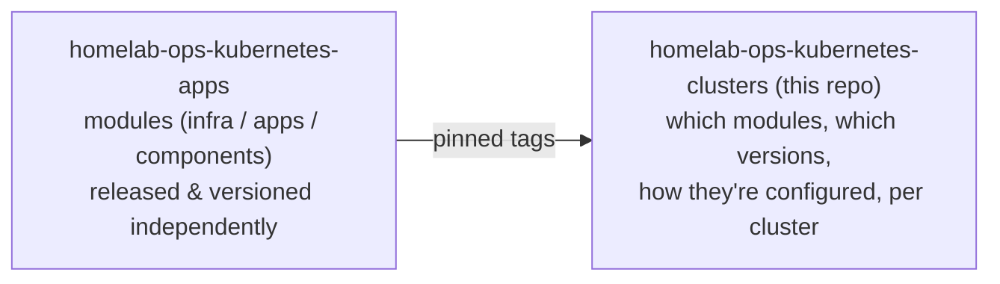

# Homelab Kubernetes Clusters

This repository defines the actual Kubernetes clusters that make up the
homelab: which modules each cluster runs, at which versions, wired together
with cluster-specific configuration. It contains no application code — only
Flux/Kustomize manifests. "Development" here means authoring and validating
YAML.

The modules themselves — infrastructure subsystems, applications, and
cross-cutting components — are built and released independently in the
sibling [`homelab-ops-kubernetes-apps`](https://github.com/ppat/homelab-ops-kubernetes-apps)
repo. This repo pins specific released versions of those modules per cluster
and configures them for that cluster's needs.

## Clusters

| Cluster | Role | Catalog |
| --- | --- | --- |
| `homelab` | Primary cluster: media, downloaders, home automation, AI, dev environments, plus the full observability/networking/security/storage/database core stack | [clusters/homelab/README.md](./clusters/homelab/README.md) |
| `nas` | Secondary cluster co-located with NAS storage: Bitwarden, Harbor container registry, and an Authentik SSO outpost, backed by NFS | [clusters/nas/README.md](./clusters/nas/README.md) |

## Finding your way

| I need to... | Look in... |
| --- | --- |
| See what's deployed on a specific cluster | [clusters/homelab/README.md](./clusters/homelab/README.md) / [clusters/nas/README.md](./clusters/nas/README.md) |
| Understand the directory layout and how modules get wired in | [DESIGN.md](./DESIGN.md) |
| Understand a module's own capabilities, prerequisites, dependencies | The module's README in the [apps repo](https://github.com/ppat/homelab-ops-kubernetes-apps) (linked from each cluster's catalog) |
| See what cluster-wide Kyverno policy is enforced | [policies/README.md](./policies/README.md) |
| Run lint/validation locally | [DESIGN.md#ci-and-validation](./DESIGN.md#ci-and-validation) |
| Understand release/versioning conventions | [DESIGN.md#versioning-and-updates](./DESIGN.md#versioning-and-updates) |
