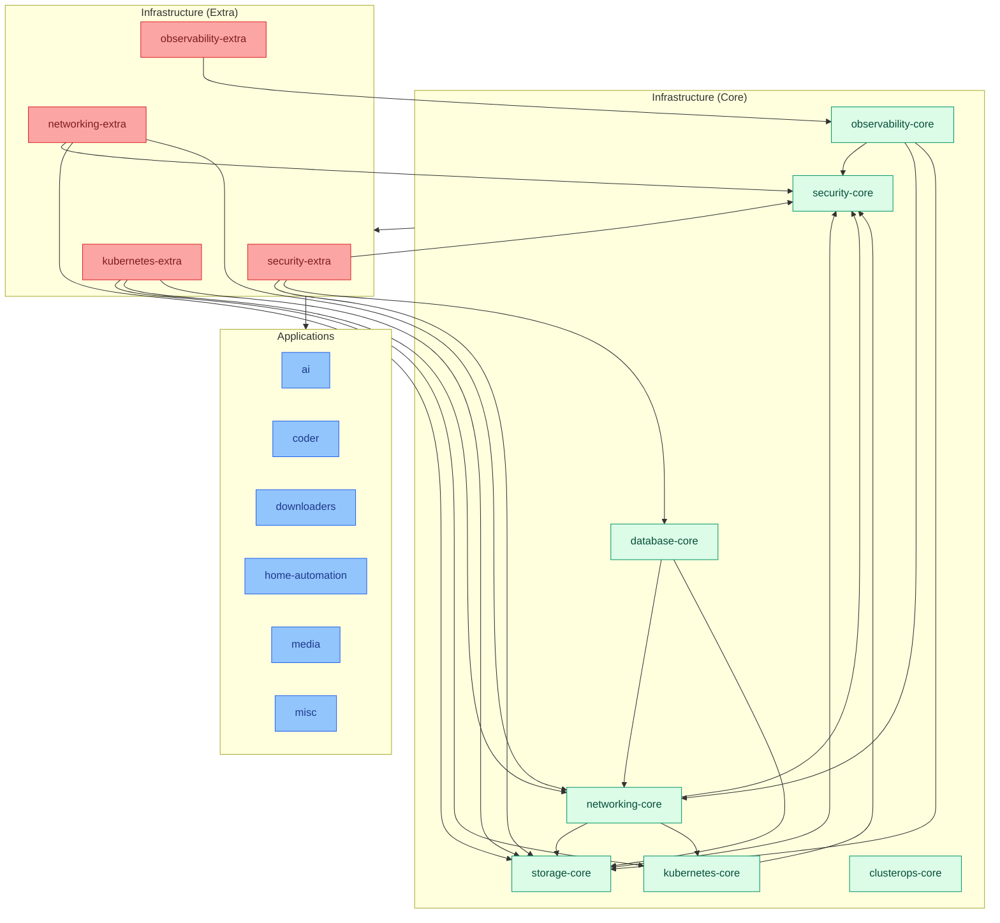

# homelab cluster

The primary cluster: full observability/networking/security/storage/database
core stack, plus end-user applications (media, downloaders, home automation,
AI, remote dev environments). Runs the **Restricted** Pod Security Standard
(see [policies/README.md](../../policies/README.md)).

For how modules get wired in (sources/kustomizations/dependsOn/patches), see
[DESIGN.md](../../DESIGN.md). For what each module itself provides, follow the
links below into the [apps repo](https://github.com/ppat/homelab-ops-kubernetes-apps).

## Infrastructure modules

| Module | Kustomization | Provides |
| --- | --- | --- |
| [security-core](https://github.com/ppat/homelab-ops-kubernetes-apps/blob/main/infrastructure/subsystems/security-core/README.md) | `infra-security-core` | cert-manager, external-secrets, trust-manager, Kyverno, Policy Reporter |
| [storage-core](https://github.com/ppat/homelab-ops-kubernetes-apps/blob/main/infrastructure/subsystems/storage-core/README.md) | `infra-storage-core` | Longhorn, MinIO, NFS CSI driver |
| [networking-core](https://github.com/ppat/homelab-ops-kubernetes-apps/blob/main/infrastructure/subsystems/networking-core/README.md) | `infra-networking-core` | MetalLB, external-dns, Traefik |
| [kubernetes-core](https://github.com/ppat/homelab-ops-kubernetes-apps/blob/main/infrastructure/subsystems/kubernetes-core/README.md) | `infra-kubernetes-core` | CoreDNS, Node Feature Discovery, Vertical Pod Autoscaler |
| [database-core](https://github.com/ppat/homelab-ops-kubernetes-apps/blob/main/infrastructure/subsystems/database-core/README.md) | `infra-database-core` | CloudNativePG |
| [observability-core](https://github.com/ppat/homelab-ops-kubernetes-apps/blob/main/infrastructure/subsystems/observability-core/README.md) | `infra-observability-core` | Prometheus, Loki, Grafana, Goldilocks |
| [clusterops-core](https://github.com/ppat/homelab-ops-kubernetes-apps/blob/main/infrastructure/subsystems/clusterops-core/README.md) | `infra-clusterops-core` | Flux CD, system-upgrade-controller, Reloader |
| [security-extra](https://github.com/ppat/homelab-ops-kubernetes-apps/blob/main/infrastructure/subsystems/security-extra/README.md) | `infra-security-extra` | Authentik (SSO identity provider) |
| [networking-extra](https://github.com/ppat/homelab-ops-kubernetes-apps/blob/main/infrastructure/subsystems/networking-extra/README.md) | `infra-networking-extra` | Pi-hole, Unbound, Tailscale operator, FreeRADIUS (Cloudflared DoH is patched out on this cluster*) |
| [observability-extra](https://github.com/ppat/homelab-ops-kubernetes-apps/blob/main/infrastructure/subsystems/observability-extra/README.md) | `infra-observability-extra` | Node Problem Detector, SNMP Exporter, Syslog-ng, UniFi Poller |
| [kubernetes-extra](https://github.com/ppat/homelab-ops-kubernetes-apps/blob/main/infrastructure/subsystems/kubernetes-extra/README.md) | `infra-kubernetes-extra` | descheduler |

\* `infra-networking-extra`'s `cloudflared-doh` `Deployment` and `pihole-secrets`
`ExternalSecret` are patched out on this cluster (see
`kustomizations/infra-networking-extra.yaml`).

## Applications

| Module | Kustomization | Provides |
| --- | --- | --- |
| [ai](https://github.com/ppat/homelab-ops-kubernetes-apps/blob/main/apps/subsystems/ai/README.md) | `apps-ai` | OpenWebUI (Ollama's own `HelmRelease` is deleted on this cluster — see note below) |
| [coder](https://github.com/ppat/homelab-ops-kubernetes-apps/blob/main/apps/subsystems/coder/README.md) | `apps-coder` | Remote development workspaces |
| [downloaders](https://github.com/ppat/homelab-ops-kubernetes-apps/blob/main/apps/subsystems/downloaders/README.md) | `apps-downloaders` | autobrr, Sonarr, Radarr, Lidarr, Prowlarr, qBittorrent, qui, SABnzbd, Seerr |
| [home-automation](https://github.com/ppat/homelab-ops-kubernetes-apps/blob/main/apps/subsystems/home-automation/README.md) | `apps-home-automation` | Home Assistant |
| [media](https://github.com/ppat/homelab-ops-kubernetes-apps/blob/main/apps/subsystems/media/README.md) | `apps-media` | Agregarr, Plex, Jellyfin, FreeTube, Tautulli |
| [misc](https://github.com/ppat/homelab-ops-kubernetes-apps/blob/main/apps/subsystems/misc/README.md) | `apps-misc` | Maddy (SMTP relay) |

Note: `apps-ai`'s `ollama-release` `HelmRelease` is deleted via patch on this
cluster — Ollama runs elsewhere and this cluster's OpenWebUI points at it.

## Cluster-specific services

Resources under `services/` that aren't modules — see
[DESIGN.md#the-services-directory](../../DESIGN.md#the-services-directory)
for the general pattern.

| Directory | Purpose |
| --- | --- |
| `services/dns/` | Tunes Pi-hole's DNS/DNSSEC/reverse-DNS behavior, picked up by name by `networking-extra`'s Pi-hole |
| `services/downloaders/` | Supplies VPN provider/server selection, port-forwarding hooks, and the WireGuard key for qBittorrent's `gluetun` VPN sidecar inside `apps-downloaders`, picked up by name |
| `services/logging/` | Tunes Loki's log retention and adds Promtail scrape jobs for apps that write logs to a PVC instead of stdout (Pi-hole, Plex, Traefik) — picked up by name by `observability-core`'s Loki/Promtail |
| `services/longhorn-system/` | Supplies S3 credentials for Longhorn's off-cluster backup target (cluster-nas MinIO), picked up by name by `storage-core`'s Longhorn |
| `services/monitoring/` | Adds extra Grafana dashboards/providers and SNMP scrape targets (a NAS, a printer), picked up by name by `observability-core`'s Grafana and `observability-extra`'s SNMP Exporter respectively |
| `services/tailscale/` | Standalone subnet-router/exit-node config for the homelab LAN — `networking-extra` ships the Tailscale operator and its CRDs, but not an instance of them; this cluster provides its own |

## Module dependency graph

`ops` (clusterops-core) has no module dependencies — it bootstraps Flux itself.
Exact per-module `dependsOn` lists are in each `kustomizations/*.yaml`.
