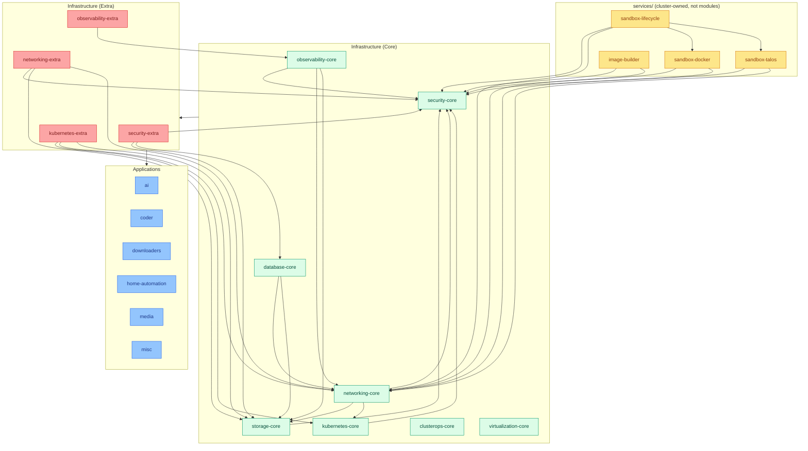

# homelab cluster

The primary cluster: full observability/networking/security/storage/database
core stack, plus end-user applications (media, downloaders, home automation,
AI, remote dev environments). Runs the **Restricted** Pod Security Standard
(see [policies/README.md](../../policies/README.md)).

For how modules get wired in (sources/kustomizations/dependsOn/patches), see
[DESIGN.md](../../DESIGN.md). For what each module itself provides, follow the
links below into the [apps repo](https://github.com/ppat/homelab-ops-kubernetes-apps).

## Infrastructure modules

| Module | Kustomization | Provides |
| --- | --- | --- |
| [security-core](https://github.com/ppat/homelab-ops-kubernetes-apps/blob/main/infrastructure/subsystems/security-core/README.md) | `infra-security-core` | cert-manager, external-secrets, trust-manager, Kyverno, Policy Reporter |
| [storage-core](https://github.com/ppat/homelab-ops-kubernetes-apps/blob/main/infrastructure/subsystems/storage-core/README.md) | `infra-storage-core` | Longhorn, MinIO, NFS CSI driver |
| [networking-core](https://github.com/ppat/homelab-ops-kubernetes-apps/blob/main/infrastructure/subsystems/networking-core/README.md) | `infra-networking-core` | MetalLB, external-dns, Traefik |
| [kubernetes-core](https://github.com/ppat/homelab-ops-kubernetes-apps/blob/main/infrastructure/subsystems/kubernetes-core/README.md) | `infra-kubernetes-core` | CoreDNS, Node Feature Discovery, Vertical Pod Autoscaler |
| [database-core](https://github.com/ppat/homelab-ops-kubernetes-apps/blob/main/infrastructure/subsystems/database-core/README.md) | `infra-database-core` | CloudNativePG, Dragonfly operator (Redis-compatible cache instances) |
| [observability-core](https://github.com/ppat/homelab-ops-kubernetes-apps/blob/main/infrastructure/subsystems/observability-core/README.md) | `infra-observability-core` | Prometheus, Loki, Grafana, Goldilocks |
| [clusterops-core](https://github.com/ppat/homelab-ops-kubernetes-apps/blob/main/infrastructure/subsystems/clusterops-core/README.md) | `infra-clusterops-core` | Flux CD, system-upgrade-controller, Reloader |
| [virtualization-core](https://github.com/ppat/homelab-ops-kubernetes-apps/blob/main/infrastructure/subsystems/virtualization-core/README.md) | `infra-virtualization-core` | KubeVirt (hosts the sandbox VMs — see Cluster-specific services below) |
| [security-extra](https://github.com/ppat/homelab-ops-kubernetes-apps/blob/main/infrastructure/subsystems/security-extra/README.md) | `infra-security-extra` | Authentik (SSO identity provider) |
| [networking-extra](https://github.com/ppat/homelab-ops-kubernetes-apps/blob/main/infrastructure/subsystems/networking-extra/README.md) | `infra-networking-extra` | Pi-hole, Unbound, Tailscale operator, FreeRADIUS (Cloudflared DoH is patched out on this cluster*) |
| [observability-extra](https://github.com/ppat/homelab-ops-kubernetes-apps/blob/main/infrastructure/subsystems/observability-extra/README.md) | `infra-observability-extra` | Node Problem Detector, SNMP Exporter, Syslog-ng, UniFi Poller |
| [kubernetes-extra](https://github.com/ppat/homelab-ops-kubernetes-apps/blob/main/infrastructure/subsystems/kubernetes-extra/README.md) | `infra-kubernetes-extra` | descheduler, Intel GPU device plugin, generic (TUN) device plugin |

\* `infra-networking-extra`'s `cloudflared-doh` `Deployment` and `pihole-secrets`
`ExternalSecret` are patched out on this cluster (see
`kustomizations/infra-networking-extra.yaml`).

## Applications

| Module | Kustomization | Provides |
| --- | --- | --- |
| [ai](https://github.com/ppat/homelab-ops-kubernetes-apps/blob/main/apps/subsystems/ai/README.md) | `apps-ai` | OpenWebUI, LiteLLM AI gateway (master-key auth only, no SSO forward-auth yet) fronting self-hosted mcp-context7, mcp-github, mcp-grafana, mcp-home-assistant, mcp-kubernetes-homelab, mcp-kubernetes-nas, mcp-kubernetes-sandbox, mcp-playwright, mcp-unifi-network, and mcp-unifi-protect MCP servers (the two host-cluster ones are read-only; only the sandbox one is writable — see `services/sandbox-talos/` below), plus n8n (workflow automation), OpenClaw (WhatsApp gateway that triggers n8n workflows), and a git-backed Obsidian knowledge vault |
| [coder](https://github.com/ppat/homelab-ops-kubernetes-apps/blob/main/apps/subsystems/coder/README.md) | `apps-coder` | Remote development workspaces |
| [downloaders](https://github.com/ppat/homelab-ops-kubernetes-apps/blob/main/apps/subsystems/downloaders/README.md) | `apps-downloaders` | autobrr, Bazarr, Sonarr, Radarr, Lidarr, Prowlarr, qBittorrent, qui, Recyclarr, SABnzbd, Seerr |
| [home-automation](https://github.com/ppat/homelab-ops-kubernetes-apps/blob/main/apps/subsystems/home-automation/README.md) | `apps-home-automation` | Home Assistant, plus a voice pipeline (NanoMQ MQTT broker, Piper TTS, Whisper STT) |
| [media](https://github.com/ppat/homelab-ops-kubernetes-apps/blob/main/apps/subsystems/media/README.md) | `apps-media` | Agregarr, Plex, Jellyfin, FreeTube, Tautulli |
| [misc](https://github.com/ppat/homelab-ops-kubernetes-apps/blob/main/apps/subsystems/misc/README.md) | `apps-misc` | Maddy (SMTP relay) |

## Cluster-specific services

Resources under `services/` that aren't modules — see
[DESIGN.md#the-services-directory](../../DESIGN.md#the-services-directory)
for the general pattern.

| Directory | Purpose |
| --- | --- |
| `services/ai/` | Supplies an optional model catalog and routing config for the LiteLLM gateway — featured model aliases with cost tracking plus a provider wildcard catch-all and router fallbacks — picked up by name by `apps-ai`'s LiteLLM `HelmRelease`. Also holds example n8n workflow exports (`services/ai/n8n/workflows/`), staged here for manual import at rollout since n8n↔OpenClaw wiring is cluster-specific |
| `services/dns/` | Tunes Pi-hole's DNS/DNSSEC/reverse-DNS behavior, picked up by name by `networking-extra`'s Pi-hole |
| `services/downloaders/` | Supplies VPN provider/server selection, port-forwarding hooks, and the WireGuard key for qBittorrent's `gluetun` VPN sidecar inside `apps-downloaders`, picked up by name |
| `services/image-builder/` | Isolated namespace for one-shot OCI image builds — the namespace and its `NetworkPolicy` only; the build `CronJob`s themselves are owned by the experiments repo, run weekly, and are also triggerable on demand with `kubectl create job --from=cronjob/…`. Open internet egress and a push-only Harbor credential, kept separate so a build pod never needs KubeVirt, VM, or host-cluster credentials. A cluster-owned workload with its own `config-services-image-builder` Kustomization, not picked up by `config-services` — see [DESIGN.md#the-services-directory](../../DESIGN.md#the-services-directory) |
| `services/logging/` | Tunes Loki's log retention and adds Alloy scrape jobs for apps that write logs to a PVC instead of stdout (Pi-hole, Plex, Traefik) — picked up by name by `observability-core`'s Loki/Alloy |
| `services/loki-query-correctness/` | A `CronJob` that captures a byte-for-byte LogQL correctness baseline against `observability-core`'s Loki and re-verifies it daily — a trial-scoped safety check for the MinIO→Garage object-store migration (`homelab-ops-kubernetes-apps#3611`), proving a storage-backend change doesn't alter query results. Not consumed by any module's own manifests and not a security boundary or new namespace, so it goes through the shared `config-services` umbrella rather than its own Kustomization. Retire by deleting this directory once cutover is proven |
| `services/longhorn-system/` | Supplies S3 credentials for Longhorn's off-cluster backup target (cluster-nas MinIO), picked up by name by `storage-core`'s Longhorn |
| `services/monitoring/` | Adds extra Grafana dashboards/providers and SNMP scrape targets (a NAS, a printer), picked up by name by `observability-core`'s Grafana and `observability-extra`'s SNMP Exporter respectively |
| `services/sandbox-docker/` | Isolated namespace for a `virtualization-core`-hosted VM running `dockerd`, so unprivileged `apps-coder` workspace pods have a real Docker Engine to point `DOCKER_HOST` at. A cluster-owned workload with its own `config-services-sandbox-docker` Kustomization, not picked up by `config-services` — see [DESIGN.md#the-services-directory](../../DESIGN.md#the-services-directory) |
| `services/sandbox-lifecycle/` | Holds the RBAC (a dedicated `ServiceAccount` plus namespace-scoped `Role`s into `sandbox-docker`/`sandbox-talos`) that an external, scheduled process uses to destroy and rebuild those two VMs, kept in its own namespace so that neither sandbox namespace ever holds a credential that can reach this cluster's own API. (What AI agents get full write access to is the *guest* inside each sandbox VM; they hold no write access to this host cluster, in any namespace. This separation is what keeps that true even though the rebuild credential must reach the host API.) Same cluster-owned-workload pattern as `sandbox-docker/` above, via its own `config-services-sandbox-lifecycle` Kustomization, which additionally `dependsOn` `config-services-sandbox-docker`/`-talos` since its `Role`s target objects in those namespaces |
| `services/sandbox-talos/` | Isolated namespace for a `virtualization-core`-hosted single-node Talos VM whose *guest* cluster AI agents get full write access to (not this host cluster — see `sandbox-lifecycle/` above). Same cluster-owned-workload pattern as `sandbox-docker/` above, via its own `config-services-sandbox-talos` Kustomization |
| `services/tailscale/` | Standalone subnet-router/exit-node config for the homelab LAN — `networking-extra` ships the Tailscale operator and its CRDs, but not an instance of them; this cluster provides its own |

## Module dependency graph

```mermaid
flowchart TB
    classDef core fill:#dcfce7,stroke:#059669,color:#064e3b
    classDef extra fill:#fca5a5,stroke:#dc2626,color:#7f1d1d
    classDef apps fill:#93c5fd,stroke:#2563eb,color:#1e3a8a
    classDef svc fill:#fde68a,stroke:#d97706,color:#92400e

    subgraph Core["Infrastructure (Core)"]
        sec[security-core]:::core
        store[storage-core]:::core
        k8s[kubernetes-core]:::core
        net[networking-core]:::core
        db[database-core]:::core
        obs[observability-core]:::core
        ops[clusterops-core]:::core
        virt[virtualization-core]:::core
    end

    subgraph Extra["Infrastructure (Extra)"]
        secx[security-extra]:::extra
        netx[networking-extra]:::extra
        k8sx[kubernetes-extra]:::extra
        obsx[observability-extra]:::extra
    end

    subgraph Apps["Applications"]
        ai:::apps
        coder:::apps
        downloaders:::apps
        homeauto[home-automation]:::apps
        media:::apps
        misc:::apps
    end

    subgraph Owned["services/ (cluster-owned, not modules)"]
        sboxdocker[sandbox-docker]:::svc
        sboxtalos[sandbox-talos]:::svc
        sboxlifecycle[sandbox-lifecycle]:::svc
        imgbuilder[image-builder]:::svc
    end

    store --> sec
    k8s --> sec
    net --> sec & store & k8s
    db --> net & store
    obs --> sec & net & store

    secx --> sec & store & db
    netx --> sec & store & net
    k8sx --> k8s & net & store
    obsx --> obs

    sboxdocker --> sec & net
    sboxtalos --> sec & net
    sboxlifecycle --> sec & net & sboxdocker & sboxtalos
    imgbuilder --> sec & net

    Core --> Extra --> Apps
```

`ops` (clusterops-core) and `virt` (virtualization-core) have no module
dependencies — `ops` bootstraps Flux itself, `virt` is self-contained (see
`kustomizations/infra-virtualization-core.yaml`). `sandbox-docker`,
`sandbox-talos`, `sandbox-lifecycle`, and `image-builder` aren't apps-repo
modules — they're `services/` Kustomizations included here because they
carry real `dependsOn` edges of their own (see
[Cluster-specific services](#cluster-specific-services) above and
[DESIGN.md#the-services-directory](../../DESIGN.md#the-services-directory));
`config-services` and the other `services/`-wide/`storage/`/`policy-*`
Kustomizations are cluster-local aggregations with no module-specific
dependency structure worth diagramming, so they're left out. Exact per-module
`dependsOn` lists are in each `kustomizations/*.yaml`.
