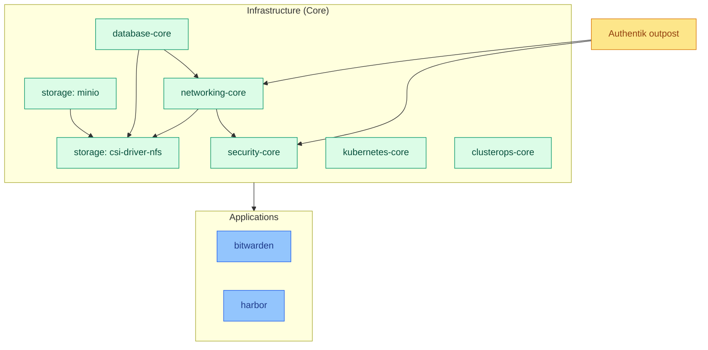

# nas cluster

Secondary cluster co-located with the NAS, backed by NFS storage. Runs
Bitwarden, the Harbor container registry, and an Authentik SSO outpost for
cross-cluster authentication. Runs the **Baseline** Pod Security Standard (see
[policies/README.md](../../policies/README.md)).

For how modules get wired in (sources/kustomizations/dependsOn/patches), see
[DESIGN.md](../../DESIGN.md). For what each module itself provides, follow the
links below into the [apps repo](https://github.com/ppat/homelab-ops-kubernetes-apps).

## Infrastructure modules

| Module | Kustomization(s) | Provides |
| --- | --- | --- |
| [security-core](https://github.com/ppat/homelab-ops-kubernetes-apps/blob/main/infrastructure/subsystems/security-core/README.md) | `infra-security-core` | cert-manager, external-secrets, trust-manager, Kyverno, Policy Reporter |
| [storage-core](https://github.com/ppat/homelab-ops-kubernetes-apps/blob/main/infrastructure/subsystems/storage-core/README.md) | `infra-storage-csi-driver-nfs`, `infra-storage-minio` | NFS CSI driver, MinIO — deployed as two separate `Kustomization`s pointing at submodule paths (`storage-core/csi-driver-nfs`, `storage-core/minio`) instead of one, since this cluster has no Longhorn |
| [networking-core](https://github.com/ppat/homelab-ops-kubernetes-apps/blob/main/infrastructure/subsystems/networking-core/README.md) | `infra-networking-core` | MetalLB, external-dns, Traefik (patched to run as a 2-replica `Deployment` instead of a `DaemonSet` for redundancy) |
| [kubernetes-core](https://github.com/ppat/homelab-ops-kubernetes-apps/blob/main/infrastructure/subsystems/kubernetes-core/README.md) | `infra-kubernetes-core` | CoreDNS, Node Feature Discovery, Vertical Pod Autoscaler |
| [database-core](https://github.com/ppat/homelab-ops-kubernetes-apps/blob/main/infrastructure/subsystems/database-core/README.md) | `infra-database-core` | CloudNativePG |
| [clusterops-core](https://github.com/ppat/homelab-ops-kubernetes-apps/blob/main/infrastructure/subsystems/clusterops-core/README.md) | `infra-clusterops-core` | Flux CD, system-upgrade-controller, Reloader |

This cluster runs no `*-extra` infrastructure modules and no `observability-core`.

## Applications

| Module | Kustomization | Provides |
| --- | --- | --- |
| [bitwarden](https://github.com/ppat/homelab-ops-kubernetes-apps/blob/main/apps/subsystems/bitwarden/README.md) | `apps-bitwarden` | Self-hosted password vault |
| [harbor](https://github.com/ppat/homelab-ops-kubernetes-apps/blob/main/apps/subsystems/harbor/README.md) | `apps-harbor` | Container image registry with vulnerability scanning |

## Cluster-specific resources

Unlike `homelab`, this cluster has no `services/` directory. Instead it has a
dedicated `outpost/` directory — content authored directly in this repo rather
than pulled from the apps repo (its `Kustomization`, `infra-security-outpost`,
sources from `root`, not a module `GitRepository`):

| Directory | Purpose |
| --- | --- |
| `outpost/` | Deploys a remote Authentik outpost, with the routing/ingress to reach it, so this cluster's Ingress can authenticate against the Authentik instance running on `homelab` without running Authentik itself here |

This exists because SSO (`components/sso`) is used across both clusters, but
Authentik itself (`security-extra`) only runs on `homelab` — the outpost lets
`nas`'s apps (Harbor, Bitwarden) participate in the same SSO domain.

## Module dependency graph

`ops` (clusterops-core) has no module dependencies — it bootstraps Flux itself.
Exact per-module `dependsOn` lists are in each `kustomizations/*.yaml`.
