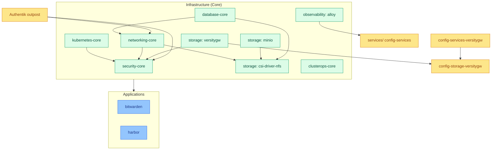

# nas cluster

Secondary cluster co-located with the NAS, backed by NFS storage. Runs
Bitwarden, the Harbor container registry, and an Authentik SSO outpost for
cross-cluster authentication. Runs the **Baseline** Pod Security Standard (see
the [homelab-ops-policies](https://github.com/ppat/homelab-ops-policies) repo).

For how modules get wired in (sources/kustomizations/dependsOn/patches), see
[DESIGN.md](../../DESIGN.md). For what each module itself provides, follow the
links below into the [apps repo](https://github.com/ppat/homelab-ops-kubernetes-apps).

## Infrastructure modules

| Module | Kustomization(s) | Provides |
| --- | --- | --- |
| [security-core](https://github.com/ppat/homelab-ops-kubernetes-apps/blob/main/infrastructure/subsystems/security-core/README.md) | `infra-security-core` | cert-manager, external-secrets, trust-manager, Kyverno, Policy Reporter |
| [storage-core](https://github.com/ppat/homelab-ops-kubernetes-apps/blob/main/infrastructure/subsystems/storage-core/README.md) | `infra-storage-csi-driver-nfs`, `infra-storage-minio`, `infra-storage-versitygw` | NFS CSI driver, MinIO, versitygw — deployed as separate `Kustomization`s pointing at submodule paths (`storage-core/csi-driver-nfs`, `storage-core/minio`, `storage-core/versitygw`) instead of one, since this cluster has no Longhorn and since the module root is what `homelab` consumes |
| [networking-core](https://github.com/ppat/homelab-ops-kubernetes-apps/blob/main/infrastructure/subsystems/networking-core/README.md) | `infra-networking-core` | MetalLB, external-dns, Traefik (patched to run as a 2-replica `Deployment` instead of a `DaemonSet` for redundancy) |
| [kubernetes-core](https://github.com/ppat/homelab-ops-kubernetes-apps/blob/main/infrastructure/subsystems/kubernetes-core/README.md) | `infra-kubernetes-core` | CoreDNS, Node Feature Discovery, Vertical Pod Autoscaler |
| [database-core](https://github.com/ppat/homelab-ops-kubernetes-apps/blob/main/infrastructure/subsystems/database-core/README.md) | `infra-database-core` | CloudNativePG, Dragonfly operator (Redis-compatible cache instances) |
| [clusterops-core](https://github.com/ppat/homelab-ops-kubernetes-apps/blob/main/infrastructure/subsystems/clusterops-core/README.md) | `infra-clusterops-core` | Flux CD, system-upgrade-controller, Reloader |
| [observability-core](https://github.com/ppat/homelab-ops-kubernetes-apps/blob/main/infrastructure/subsystems/observability-core/README.md) (submodule cherry-pick) | `infra-observability-alloy` | Alloy — the node-collector `DaemonSet` (pod logs, systemd journal, and this cluster's own metrics pipeline, see below) and the Kubernetes-events singleton `Deployment` — pointed at `path: ./infrastructure/subsystems/observability-core/alloy`, not the module root |

This cluster runs no `*-extra` infrastructure modules and no full `observability-core` —
this cluster has neither Prometheus nor Loki nor Grafana of its own. Metrics and logs ship
to homelab's instead: see [Cluster-specific resources](#cluster-specific-resources) below
for the collector-side pieces this cluster owns to make that work.

## Applications

| Module | Kustomization | Provides |
| --- | --- | --- |
| [bitwarden](https://github.com/ppat/homelab-ops-kubernetes-apps/blob/main/apps/subsystems/bitwarden/README.md) | `apps-bitwarden` | Self-hosted password vault |
| [harbor](https://github.com/ppat/homelab-ops-kubernetes-apps/blob/main/apps/subsystems/harbor/README.md) | `apps-harbor` | Container image registry with vulnerability scanning |

## Cluster-specific resources

Content authored directly in this repo (rather than pulled from the apps repo as a
versioned module) lives as its own top-level directory, each with its own dedicated
`Kustomization` sourced from `root`, not a module `GitRepository`:

| Directory | Purpose |
| --- | --- |
| `outpost/` | Deploys a remote Authentik outpost, with the routing/ingress to reach it, so this cluster's Ingress can authenticate against the Authentik instance running on `homelab` without running Authentik itself here |
| `services/` | Mirrors `homelab`'s `services/` layout, built as one `config-services` Kustomization: `monitoring/` (the `monitoring`/`logging` namespaces, `kube-state-metrics` and `prometheus-node-exporter` standalone charts, and a `prometheus-operator-crds` chart that deliberately presents this cluster's own long-torn-down `kube-prometheus-stack` Helm release identity so it adopts the `monitoring.coreos.com` CRDs already on the cluster rather than conflicting with them) and `logging/` (the `grafana-repository` `HelmRepository` the alloy cherry-pick needs, and a `ClusterRole`/`ClusterRoleBinding` granting the collector's own `ServiceAccount` the extra access its metrics fragment needs — the fragment itself has no on-disk copy; it lives only in `infra-observability-alloy.yaml`'s Flux patch, which CI lints by extracting it directly) |

`outpost/` exists because SSO (`components/sso`) is used across both clusters, but
Authentik itself (`security-extra`) only runs on `homelab` — the outpost lets
`nas`'s apps (Harbor, Bitwarden) participate in the same SSO domain.

`services/` exists because this cluster's metrics/logs pipeline needs pieces the module's
`alloy` submodule cherry-pick alone doesn't provide: the namespaces the module's own
`namespace.yaml` would normally create (a submodule `spec.path` never fetches the module
root), a Prometheus-compatible target surface for the 20+ `ServiceMonitor`/`PodMonitor`
objects this cluster's other charts already ship, and the CRDs those objects depend on.
`kube-state-metrics` and `node-exporter` are picked up by the alloy `DaemonSet`'s own
`prometheus.operator.servicemonitors`/`podmonitors` components (see the metrics fragment
embedded in `kustomizations/infra-observability-alloy.yaml`) the same way every other
`ServiceMonitor` on this cluster is — no per-chart wiring needed.

The object store departs from the shared pattern in a third way: two subtrees that sit
*inside* `storage/` and `services/` but are deliberately left out of those directories'
`kustomization.yaml` files, each reconciled by a `Kustomization` of its own.

| Subtree | Kustomization | Why it is separate |
| --- | --- | --- |
| `storage/versitygw/` | `config-storage-versitygw` | Carries the object store's iSCSI `PersistentVolume`/claim, the `versitygw` namespace the claim needs, and the suspended one-shot `CronJob` that prepares a freshly formatted LUN. Outside `config-storage` so that a failure here cannot stop the Kustomization MinIO depends on, while MinIO still holds the only copy of every backup |
| `services/versitygw/` | `config-services-versitygw` | Carries the object store's `ServiceMonitor`s. Outside `config-services` and outside the volume's Kustomization so that a red status on either never means "a scrape declaration is wrong" |

This is the estate's first in-tree (non-CSI) volume, and `nas`'s first non-NFS one. The
in-tree `iscsi` plugin shells out to `iscsiadm` on the node, so the node itself must have
`open-iscsi` installed with `iscsid` running, and the initiator IQN in
`/etc/iscsi/initiatorname.iscsi` must be in the LUN's allowed-initiator list on the
Synology — a host-level prerequisite no manifest can express, and one a VM rebuild
silently breaks by regenerating that file.

The `docker.io` pull-through mirror (`Ingress` + rewrite `Middleware` pair
fronting `harbor-core` on its own hostname, `dockerio-harbor.${domain_name}`)
that used to live here as `harbor-dockerio-mirror/` has been upstreamed into
the `apps-harbor` module itself (`apps-harbor` ships it directly as of
`apps-harbor-v0.0.19`) — it's no longer cluster-specific content. See the
[harbor module README](https://github.com/ppat/homelab-ops-kubernetes-apps/blob/main/apps/subsystems/harbor/README.md)
and ppat/homelab-ops-kubernetes-experiments#226 for why it exists.

## Module dependency graph

```mermaid
flowchart TB
    classDef core fill:#dcfce7,stroke:#059669,color:#064e3b
    classDef apps fill:#93c5fd,stroke:#2563eb,color:#1e3a8a
    classDef outpost fill:#fde68a,stroke:#d97706,color:#92400e

    subgraph Core["Infrastructure (Core)"]
        sec[security-core]:::core
        nfs[storage: csi-driver-nfs]:::core
        minio[storage: minio]:::core
        vgw[storage: versitygw]:::core
        k8s[kubernetes-core]:::core
        net[networking-core]:::core
        db[database-core]:::core
        ops[clusterops-core]:::core
        alloy[observability: alloy]:::core
    end

    subgraph Apps["Applications"]
        bw[bitwarden]:::apps
        harbor:::apps
    end

    out[Authentik outpost]:::outpost
    svc[services/ config-services]:::outpost
    vol[config-storage-versitygw]:::outpost
    vgwmon[config-services-versitygw]:::outpost

    k8s --> sec
    net --> sec & nfs
    minio --> nfs
    vgw --> sec & vol
    vgwmon --> vol
    db --> net & nfs
    out --> sec & net
    alloy --> svc

    Core --> Apps
```

`ops` (clusterops-core) has no module dependencies — it bootstraps Flux itself.
`out` (Authentik outpost), `svc` (`services/`, the `config-services`
Kustomization), `vol` (`config-storage-versitygw`) and `vgwmon`
(`config-services-versitygw`) aren't apps-repo modules — they're the
repo-authored Kustomizations described in
[Cluster-specific resources](#cluster-specific-resources) above, included here
because they carry real `dependsOn` edges of their own: `alloy` depends on
`svc` for the `monitoring`/`logging` namespaces and CRDs its ServiceMonitor/
PrometheusRule need, and both `vgw` and `vgwmon` depend on `vol` for the volume
and the namespace. Exact per-module `dependsOn` lists are in each
`kustomizations/*.yaml`. The `docker.io` mirror's routing dependency on
`harbor`/`networking-core` is now internal to the `apps-harbor` module (see
above) and isn't a separate cluster-level edge.
