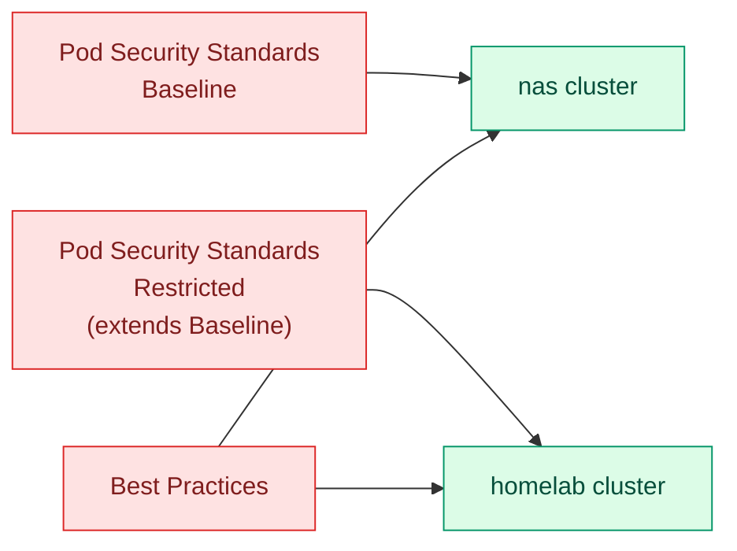

# Policies

Cluster-wide [Kyverno](https://kyverno.io/) `ClusterPolicy`/`ClusterCleanupPolicy`
objects, applied identically across both clusters (unlike everything under
`clusters/`, these aren't per-cluster — they live at the repo root because
they're cluster-agnostic). Each policy group here is deployed via its own
`policy-*` Flux `Kustomization` per cluster; see
[DESIGN.md#policy-enforcement](../DESIGN.md#policy-enforcement) for how that
wiring works.

## Groups

| Group | Path | Applied to |
| --- | --- | --- |
| Pod Security Standards — Baseline | [`pod-security-standard/baseline`](./pod-security-standard/baseline) | `nas` only |
| Pod Security Standards — Restricted | [`pod-security-standard/restricted`](./pod-security-standard/restricted) | `homelab` only (includes baseline via `resources: [../baseline]`) |
| Best Practices | [`best-practices`](./best-practices) | Both clusters |

`homelab` runs the stricter Restricted profile; `nas` runs Baseline. All
policies across both groups currently run in `validationFailureAction: Audit`
mode (patched at the point of use in each cluster's `policy-*.yaml`
`Kustomization`) — they report violations via Policy Reporter rather than
blocking admission.

## Pod Security Standards

Ports the upstream [Kubernetes Pod Security Standards](https://kubernetes.io/docs/concepts/security/pod-security-standards/)
to Kyverno `ClusterPolicy` validation rules.

| Policy | What it disallows/requires |
| --- | --- |
| `disallow-capabilities` | Capabilities beyond a default-safe set |
| `disallow-host-namespaces` | Host PID/IPC/network namespaces |
| `disallow-host-path` | `hostPath` volumes |
| `disallow-host-ports` | `hostPort` |
| `disallow-host-process` | Windows HostProcess containers |
| `disallow-privileged-containers` | `privileged: true` |
| `disallow-proc-mount` | Non-default `procMount` |
| `disallow-selinux` | Custom `seLinuxOptions` |
| `restrict-apparmor-profiles` | Non-default AppArmor profiles |
| `restrict-seccomp` | `seccompProfile: Unconfined` |
| `restrict-sysctls` | Unsafe sysctls |

Restricted adds on top of all of the above:

| Policy | What it disallows/requires |
| --- | --- |
| `disallow-capabilities-strict` | Any capability except `NET_BIND_SERVICE` |
| `disallow-privilege-escalation` | `allowPrivilegeEscalation: true` |
| `require-run-as-non-root-user` | `runAsUser` unset or 0 |
| `require-run-as-nonroot` | `runAsNonRoot` unset/false |
| `restrict-seccomp-strict` | Missing seccomp profile (not just `Unconfined`) |
| `restrict-volume-types` | Volume types beyond a safe allow-list |

## Best Practices

Applied to both clusters. Mixes validation, mutation, and scheduled cleanup:

| Policy | Type | What it does |
| --- | --- | --- |
| `add-default-resources` | Mutate | Adds default CPU/memory requests to containers missing them |
| `add-emptydir-sizelimit` | Mutate | Adds a `sizeLimit` to `emptyDir` volumes missing one |
| `add-ndots` | Mutate | Sets DNS `ndots: 1` on Pods, avoiding an extra DNS lookup per query |
| `disallow-cri-sock-mount` | Validate | Blocks mounting the container runtime socket |
| `disallow-latest-tag` | Validate | Requires an explicit, non-`latest` image tag |
| `require-probes` | Validate | Requires a liveness, readiness, or startup probe on every container |
| `restrict-node-port` | Validate | Blocks `Service` type `NodePort` |
| `cleanup-bare-pods` | Cleanup | Deletes unowned (controller-less) Pods on a daily schedule |
| `cleanup-empty-replicasets` | Cleanup | Deletes empty `ReplicaSet`s on a recurring schedule |

Each policy excludes the system namespaces and workloads that legitimately need
the behavior it otherwise disallows (e.g. `require-probes` doesn't apply to a
handful of infra DaemonSets that have none) — the exact exclusion list is a
policy-tuning detail that lives in, and should be read from, each policy's own
`exclude` block rather than restated here.
